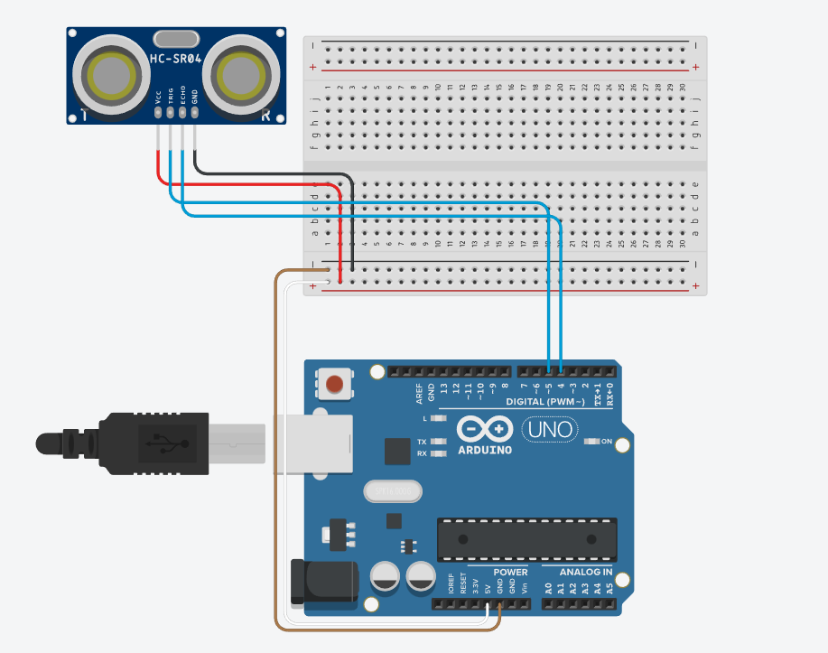

# Implementação de um sistema de Lixeira Inteligente com Arduino

#### Autor: Marcos Paulo Anunciação Beck
#### Petrópolis - RJ - Dezembro 2022

Declaro, para fins de pesquisa acadêmica, didática e tecnico-científica, que o presente projeto pode ser parcial ou totalmente utilizado desde que se faça referência à fonte e ao autor.

## Resumo
Com o crescimento do volume de lixo gerado todos os dias, o controle e coleta se tornam um enorme desafio. Diante disso, esse projeto visa desenvolver uma lixeira inteligente, capaz de detectar o volume de resíduos em seu interior, facilitando a localização de pontos críticos e otimizando a rota de coleta. A aplicação desse projeto tem como base a utilização de uma placa \textit{Arduíno Uno} com um \textit{shield Ethernet} e um \textit{sensor ultrasom}, além disso a ferramenta \textit{TAGO} foi utilizada como API para coleta das informações.
O projeto poderá ser expandido no futuro, visando sua implementação em pontos denominados da cidade, a fim de potencializar a coleta diária de lixo.

Palavras-chave: Lixeira Inteligente. Coleta de Lixo. Meio Ambiente. Arduino. C++, JSON.

## Capítulo 1
### Introdução
O projeto de criação de uma lixeira inteligente controlada por um arduíno, partiu de uma sugestão proposta dentro da Universidade, como objeto de estudos para a disciplina de TCD (Teoria da Comunicação de Dados).
Foi sugerido então, a criação de um protótipo onde, com a ajuda de sensores ultrassom, a lixeira conseguisse detectar a volume de resíduos interno e transmitir essa informação para uma API, que monitoraria esses dados.

Durante o processo, a plataforma Tinkercad foi fundamental como ferramente de estudo e apoio do arduíno e seus componentes.

A implementação base também visa desenvolver uma solução prática de expansão do projeto, com o objetivo de, em um futuro próximo, facilitar a localização de lixeiras em estado crítico de acúmulo de resíduos e otimizar a sua coleta.

### Justificativa
Em 2019, a quantidade de lixo jogado nas ruas teve um aumento de 16% com relação a uma década atrás, chegando à marca de 29,4 milhões de toneladas. Isso se dá por vários motivos, dentre eles, podemos citar a superlotação de lixeiras, que dependendo do local em que se encontra, pode alcançar seu limite em pouco tempo, o que gera também um aumento de resíduos deixados na rua, visto que o pensamento é: “a lixeira está lotada, vou jogar deixar aqui do lado mesmo”.

### Motivação
Levando em consideração esse problema, o projeto visa desenvolver um sistema inteligente para detectar a quantidade de lixo presente em uma lixeira, para que seja possível fazer um controle remoto, traçando um plano de coleta desse lixo. O conceito é começar com um exemplar do sistema, que possa ser expandido para diversos pontos posteriormente, e que no futuro tenha um programa de automação que determine rotas para que, em um exemplo de cidade, o caminhão de coleta possa fazer uma rota otimizada para a limpeza do lixo.

### Objetivos
#### Objetivo Geral
O principal objetivo desse projeto é solucionar de forma eficiente o problema de coleta de lixo em lixeiras de pequeno porte, a fim de criar um método consistente e através dele implementar a solução proposta em lixeiras de grande porte, para minimizar o impacto ambiental, facilitar a identificação de pontos críticos, e otimizar as rotas de coleta.

#### Objetivo específico

* Idealizar o Dispositivo;
* Definir as ferramentas e materiais necessários; 
* Obter as ferramentas e materiais necesários;
* Implementar a Metodologia;
* Implementar o software do Arduino, que será responsável por receber os dados coletados pelo sensor ultrassom e os enviar para a API TAGO através da linguagem JSON;
* Implementar a comunicação do Arduíno utilizando um módulo Ethernet Shield;
* Implementar a configuração da API TAGO para a coleta dos dados;
* Construção física do dispositivo;
* Realizar a impressão 3D da case que comportará o arduíno e seu módulo para proteção.
* Apresentação dos resultdos obtidos.

### Materiais
Para a construção da lixeira inteligente foram utilizados os seguintes materiais:

* Uma lixeira plástica;
* Um Arduino UNO;
* Um sensor de ultrassom;
* Um cabo USB-Tipo B;
* Um módulo shield ethernet;
* Uma case para o Arduino, construida através de uma impressora 3D;
* Fiação.

## Capítulo 2
### Implementação

Neste capítulo é descrito como foi feito a implementação e montagem do sistema da lixeira inteligente, além de uma breve explicação do seu funcionamento.

### Apresentação do Sistema
O sistema da lixeira inteligente foi projetado através da plataforma *Tinkercadd* que proporciona um ótimo ambiente de desenvolvimento e segurança na manipulação dos equipamentos eletrônicos. Enquanto em funcionamento, o sensor ultrassonico faz a leitura do volume de resíduos dentro do recipiente (lixeira) e ao receber a informação, a envia para a API, atualizando a gráfico.


Por se tratar de um projeto onde não há necessidade de precisão exata e nem de atualização em tempo real, foi decidido que o envio e recebimento do sensor ultrassonico aconteceria a cada cinco segundos. Dessa forma esperasse que o sensor ultrassonico prolongue seu tempo de funcionamento, preservando sua integridade e a do sistema.

### Arduino

Nesta parte será descrita a implementação do *Arduino* tanto da parte de software quanto da parte de hardware mostrando como está configurado os pinos e módulos utilizados.

#### Hardware

É necessário que o *Arduino* esteja ligado a rede através de um cabo *Ethernet* para conseguir se comunicar com a API. A alimentação é realizada através de um cabo *USB-Tipo B*. O mesmo cabo é utilizado para transferir o código fonte do computador para a placa através da *Arduino IDE*. 

Além da placa *Arduino* também foi utilizado um *shield Ethernet* que habilita a conexão com a internet, através o um cabo *Ethernet* RJ-45, para o envio das informações para a API, e foi utilizado o módulo de Ultrassom conectado no pino 4 para o trigger e no pino 5 para o echo.

A Figura 2.2 representa o diagrama do circuito desenvolvido na plataforma *Tinkercad*, que depois foi aplicado no meio físico de desenvolvimento, como é possível ver na figura 2.3.



#### Software

O código aplicado ao Arduino faz com que ele se conecte a API da *TAGO* através de uma conexão de internet e logo após, aciona o sensor ultrassonico, que faz a leitura do interior da lixeira, medindo a distância em centímetros do primeiro ponto de impacto do ultrassom e devolvendo essa informação através de um *JSON* para a *API TAGO*.

Para a conexão com a internet é utilizado um *byte mac[]* que captura o IP do cliente e transmite para a *TAGO* através da string de conexão. Antes disso, é feita a verificação da presença do *shield ethernet* e da conexão com a rede e caso um desses falhe, a aplicação é encerrada até que ambos respondam devidamente.


### Aplicação em C++ desenvolvida na IDE do Arduino

Esse tópico visa descrever a implementação da aplicação em *C++* responsável pelo funcionamento do dispositivo, na qual faz a comunicação entre o sensor ultrassonico, o *arduíno* e a *API TAGO*.

#### Comunicação com o Arduino

A comunicação do Arduino com a *API TAGO* é realizada através de um cabo *Ethernet* conectado a um *shield Ethernet*, utilizando a biblioteca ```Ethernet.h```

A conexão é realizada através da porta 80 (padrão para HTTP). Antes de qualquer coleta de dados é verificado se o *shield Ethernet* está respondendo devidamente a aplicação através do método ```Ethernet.hardwareStatus```, bem como se existe uma conexão online válida através do método ```Ethernet.linkStatus```.

Para o envio das informações, é montada, de forma sequencial, uma string de conexão com a *TAGO*, que comporta o *Token* de acesso com a *API*, como visto na imagem abaixo.


Os dados de leitura do sensor são enviados via *POST* no formato *JSON* para a *API* que interpreta a variável e atualiza o gráfico.

#### Código Fonte
```
#include <SPI.h>
#include <Ethernet.h> //Carrega as bibliotecas para conexao Ethernet
#include <Ultrasonic.h> //Carrega a biblioteca do sensor ultrassonico
#define pino_trigger 4 //Define o pino trigger do sensor ultrassonico
#define pino_echo 5 //Define o pino echo do sensor ultrassonico

const int tubo = 24; // define a altura da lixeira em cm através da marcação máxima do sensor ultrassonico.

byte mac[] = {
  0xDE, 0xAD, 0xBE, 0xEF, 0xFE, 0xED
};

EthernetServer server(80); //(port 80 é o padrao para HTTP)
EthernetClient client;
String valor1Send = "LIXEIRA INTELIGENTE";

Ultrasonic ultrasonic(pino_trigger, pino_echo); //Inicializa o sensor nos pinos definidos acima.

void setup() {

  Serial.begin(9600);
  Serial.println("Lendo os dados do sensor...");
  
  // Inicia a conexao Ethernet e o servidor
  Ethernet.begin(mac);

  // Checa se existe um um hardware Ethernet
  if (Ethernet.hardwareStatus() == EthernetNoHardware) {
    Serial.println("Ethernet shield nao foi encontrado.");

    while (true) {
      delay(1);
    }
  }
  if (Ethernet.linkStatus() == LinkOFF) {
    Serial.println("Cabo Ethernet nao esta conectado.");
  }

  // Inicia o Servidor
  server.begin();
  Serial.print("Servidor conectado em ");
  Serial.println(Ethernet.localIP());
}

/**
* COLETA AS INFORMACOES DO SENSOR ULTRASSOM, EM CM
*/
float coleta() {
  float cmMsec;
  float porcentagem;

  long microsec = ultrasonic.timing();
  cmMsec = ultrasonic.convert(microsec, Ultrasonic::CM);

  //Converte a leitura do sensor em porcentagem.
  porcentagem = (int(cmMsec) * 100) / tubo;
  
  //Inverte a porcentagem.
  porcentagem = (100 - porcentagem);

  //Correção da sensibilidade do sensor ultrassom.
  if(porcentagem > 0 && porcentagem < 6){
    porcentagem = 0;
  }else if(porcentagem < 0 || porcentagem > 100){
    porcentagem = 100;
  }

  //Exibe informacoes no serial monitor.
  Serial.print("Distancia em cm: ");
  Serial.print(cmMsec);
  
  delay(1000);
  
  return porcentagem;  
}

/**
* CONEXAO COM A API TAGO E ENVIO DE INFORMACOES
*/
void loop() {
  if (Serial.available()){
    valor1Send = Serial.readString();
  }

  String envio = "";

  if (client.connect("api.tago.io", 80)) {
    Serial.println("CONECTOU");
    envio = "POST /data  HTTP/1.1\n";
    envio += "Host: api.tago.io\n";
    
    envio += String("Device-Token: ") + "b9e6691d-e18f-406b-b0ad-6c663c55d55d" + "\n";
    envio += " ssl: false\n";
    envio += String("Content-Type: ") + "application/json" + "\n";

    float valorA0 = coleta();

    String dados = "[{\"variable\":\"valor1\",\"value\":\"";
    dados += valor1Send;
    dados +=  "\"},{\"variable\":\"valor2\",\"value\":\"";
    dados += String(valorA0) + "\"}]";

    envio += String("Content-Length: ") + String(dados.length()) + "\n";
    envio += "\n";
    envio += dados;
    Serial.println(envio);

    client.print(envio);

    unsigned long timeout = millis();
    while (client.available() == 0) {
      if (millis() - timeout > 5000) {
        Serial.println(">>> Client Timeout !");
        client.stop();
        return;
      }
    }

    // Lê todas as linhas replicadas pelo servidor e imprime na Serial.
    while (client.available()) {
      String line = client.readStringUntil('\r');
      Serial.print(line);
    }
    client.stop();
    Serial.println();
    Serial.println("Encerrando conexao.");
    Serial.println();
    Serial.println();

  }
  else {
    Serial.println("Nao conectou!");
  }
}
```

### API TAGO


Dentro da *API TAGO*, foi criada uma *dashboard* que disponibiliza um gráfico de volume, vide Figura 2.6. Esse gráfico é atualizado toda vez que o *arduino* envia um dado para a aplicação.

Para criar a *dashboard*, foi necessário a criação de um *Device*. A partir do dispositivo gerado, foi disponibilizado um *token* de conexão, vide Figura 2.4 que é implementado na *string* de conexão. Também foi necessário a criação de uma variável que responde diretamente ao *JSON* enviado pelo *arduino*, fazendo assim a leitura do dado e transmitindo para o gráfico.


### Acesso Online


Através da plataforma *Github*, foi hospedada uma página simples em *HTML*, contendo um *iframe*, que é disponibilizado pela própria *API TAGO*. Esse *iframe* gera um demonstrativo visual do gráfico dentro da *API*, vide Figura 2.8. Essa página é atualizada a cada cinco segundos, ficando assim disponível online para que qualquer usuário consiga visulizar a informação sem a necessidade de estar logado diretamente a *API TAGO*.


Segue o link de acesso ao demonstrativo:
[Demonstrativo](https://lixeirainteligente.github.io/LixeiraInteligenteTCD2022/)

### Case 3D

Também, através da plataforma *Tinkercad*, foi adquirido gratuitamente um modelo *3D* de case para o *arduino* conectado ao módulo *shield ethernet* do usuário *papp.zoltan*. Vide Figura 2.8.


## Capítulo 3
### Conclusão e trabalhos futuros

Durante o desenvolvimento desse projeto, foi proposto o desenvolvimento de uma lixeira inteligente, capaz de identificar a quantidade de resíduos em seu interior e transmitir essa informação de forma clara à uma API, com o intuito de monitoramento.

O material utilizado na construção da lixeira foi disponibilizado pela universidade Faeterj - Petrópolis, sem custos. Todos os *softwares* utilizados para o desenvolvimento são gratuitos ou *opensource* e não geraram custos.

Durante o desenvolvimento, tive a oportunidade de desenvolver novas habilidades em várias áreas ainda não exploradas, como o *Arduino*, a *API TAGO* e a plataforma *Tinkercad*.

Através de bastante pesquisa, foi possível adquirir as habilidades necessárias para a construção do projeto, sua elaboração e finalização, tanto da parte física, quanto da parte lógica, como a construção do circuito e a programação do código fonte.

Foram pensadas várias outras funcionalidades, como a utilização de um segundo sensor ultrassonico e um servo motor para criar um mecanismo de abertura automática da lixeira, mas não entrou nesse projeto. Também é possível a expansão do projeto, utilizando módulos *WIFI* para eliminar a necessidade de uma conexão cabeada e a utilização de uma bateria de 9v junto com um regulador de tensão 5v para adicionar a capacidade de alimentação sem fio ao dispositivo.

Como projeto de expansão, foi pensada a possibilidade de estender o projeto a lixeiras maiores, a fim de possibilitar o monitoramento de uma cidade, por exemplo, e otimizar as rotas de coleta.

### Referências
AUTOMOCAO, C. I. de. Arduino CPB com POST JSON Ethernet - TAGOio. c2021.
Disponível em: https://www.youtube.com/watch?v=p0Vi_-BnI2k&ab_channel=CrescerInd%C3%BAstriadeAutoma%C3%A7%C3%A3o. Acesso em: 03 nov. 2022.

BEDEN Ömer. Smart Trash © GPL3+. c2017. Disponível em: https://create.arduino.cc/projecthub/omer-beden/smart-trash-77be58. Acesso em: 5 set. 2022.

CHANNEL, I. Criando a sua própria Lixeira Inteligente: Protótipo do Circuito Eletrônico
da Lixeira (Parte 2). c2021. Disponível em: https://inovaedu.tech/lixeira-inteligent-parte-2/
. Acesso em: 29 nov. 2022.

JOSIE99. Smart Trash Bin Automation. c2019. Disponível em: https://create.arduino.cc/projecthub/josie99/smart-trash-bin-automation-7c8dea. Acesso em: 05 set. 2022.

PEREIRA, A. S. L. P. Lixeira Inteligente Arduino. c2020. Disponível em: http://sistemaolimpo.org/midias/uploads/1bd63396d5413457f7a7a82cd6e61273.pdf. Acesso em: 01 dez. 2022.

SATO, G. Y. Lixeira Inteligente. c2017. Disponível em: http://paginapessoal.utfpr.edu.br/sato/material-didatico/projeto-integrador/material-de-projetos-de-disciplina/GS1707_spec_integrador_2_2017_v0.pdf. Acesso em: 04 set. 2022.
